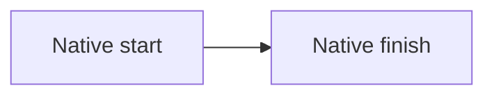
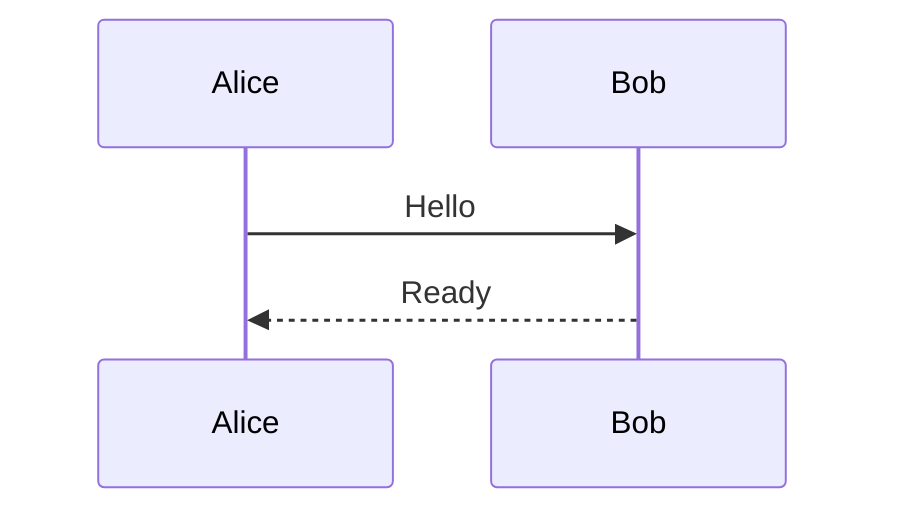

# Mermaid native preview

```mermaid
flowchart LR
    A[Native start] --> B[Native finish]
```

```mermaid
flowchart LR
    A[Native start] --> B[Native finish]
```

```mermaid
sequenceDiagram
    Alice->>Bob: Hello
    Bob-->>Alice: Ready
```

```mermaid
unknownDiagram
    A --> B
```

Math remains $x^2$, and **the surrounding paragraph survives**.
